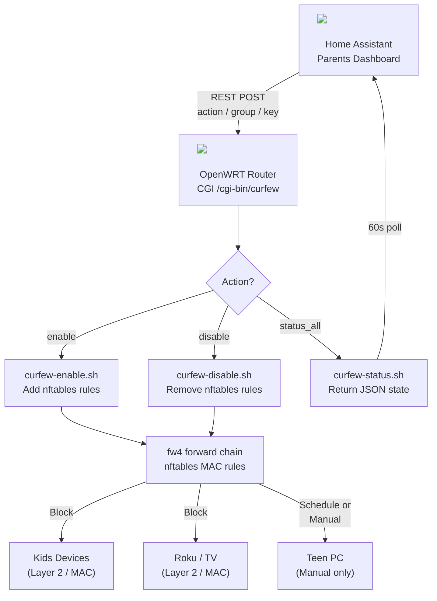

## Overview

The problem: kids hiding under the covers with a tablet or sneaking downstairs to watch TV until 4 AM. The solution: cut the internet to their devices on a schedule, with a quick toggle on the parents' dashboard to restore or enforce it on demand — no negotiations, no excuses.

Built entirely local and cloud-free. OpenWRT enforces the actual firewall rules, and Home Assistant provides the dashboard toggle. No third-party app, no subscription, no calling home — just nftables, a small CGI script, and a REST sensor.

Rules target devices at **Layer 2 by MAC address**, which means they work regardless of IP assignment, VLAN membership, or connection type — a device is blocked whether it's on Wi-Fi, wired Ethernet, or roams between them, and DHCP lease renewals don't help.

## Curfew Groups

| Group | Type | Schedule |
|-------|------|----------|
| Kids devices | Scheduled | 12 am–7 am nightly, 11 pm–midnight Sun–Thu, 8 am–3 pm Fridays |
| Downstairs Roku | Scheduled | Same as above |
| Teen's PC | Manual only | Blocked on demand — auto-disables at 7 am if left on |
| Family Room TV | Manual only | Same as Teen's PC |

Scheduled groups are restored at boot. Manual-only groups are intentionally not re-enabled after a router reboot.

## Architecture



## Prerequisites

- OpenWRT router with `nftables` firewall (fw4, OpenWRT 22.03+)
- `uhttpd` web server (standard on OpenWRT)
- Home Assistant with `command_line`, `rest_command`, and `template` integrations
- The MAC addresses of the devices you want to block

## OpenWRT Setup

### 1. Generate an API Key

Generate a random key to authenticate requests from HA to the router:

```sh
cat /dev/urandom | tr -dc 'A-F0-9' | head -c 64
```

Use this key everywhere `YOUR_API_KEY` appears below. Keep it out of version control.

### 2. MAC List File — `/usr/bin/curfew-macs.sh`

All groups live in a single file. This is the only file you need to edit when adding or removing a device.

```sh
#!/bin/sh
MACS_KIDS="{ aa:bb:cc:dd:ee:01, aa:bb:cc:dd:ee:02, aa:bb:cc:dd:ee:03 }"
MACS_ROKU="{ aa:bb:cc:dd:ee:04 }"
MACS_TEEN="{ aa:bb:cc:dd:ee:05 }"
MACS_TV="{ aa:bb:cc:dd:ee:06 }"
```

> **Finding MAC addresses:** Check `/tmp/dhcp.leases` on the router or your router's DHCP client list.

> **Important:** Each value must be in double quotes: `MACS_GROUP="{ aa:bb:... }"`. Without quotes, the shell treats `{` as a command group and the script fails silently.

### 3. Enable Script — `/usr/bin/curfew-enable.sh`

Sources the single MAC file, then sets `CURFEW_MACS`, `CHECK`, and `PREFIX` in one case branch. Scheduled groups get three time-window rules; manual groups get one unconditional block.

```sh
#!/bin/sh
GROUP="${1:-kids}"

. /usr/bin/curfew-macs.sh

case "$GROUP" in
  kids) CURFEW_MACS="$MACS_KIDS"; CHECK="Kids-Every-Morning"; PREFIX="Kids" ;;
  roku) CURFEW_MACS="$MACS_ROKU"; CHECK="Roku-Every-Morning"; PREFIX="Roku" ;;
  teen) CURFEW_MACS="$MACS_TEEN"; CHECK="Teen-Curfew-Block";  PREFIX="Teen" ;;
  tv)   CURFEW_MACS="$MACS_TV";   CHECK="TV-Curfew-Block";    PREFIX="TV"   ;;
  *) logger -t curfew "ERROR: enable called with unknown group '$GROUP'"; exit 1 ;;
esac

if nft list chain inet fw4 forward | grep -q "$CHECK"; then
  logger -t curfew "SKIP: $GROUP already enabled"
  exit 0
fi

logger -t curfew "ENABLE: $GROUP starting"

if [ "$GROUP" = "kids" ] || [ "$GROUP" = "roku" ]; then
  nft add rule inet fw4 forward \
    ether saddr $CURFEW_MACS \
    meta hour "00:00"-"07:00" \
    counter drop comment "${PREFIX}-Every-Morning"
  logger -t curfew "NFT ADD: ${PREFIX}-Every-Morning (12am-7am daily)"

  nft add rule inet fw4 forward \
    ether saddr $CURFEW_MACS \
    meta day { "Sunday", "Monday", "Tuesday", "Wednesday", "Thursday" } \
    meta hour "23:00"-"23:59" \
    counter drop comment "${PREFIX}-SchoolNight-Late"
  logger -t curfew "NFT ADD: ${PREFIX}-SchoolNight-Late (11pm-midnight Sun-Thu)"

  nft add rule inet fw4 forward \
    ether saddr $CURFEW_MACS \
    meta day "Friday" \
    meta hour "08:00"-"15:00" \
    counter drop comment "${PREFIX}-Friday-08to15"
  logger -t curfew "NFT ADD: ${PREFIX}-Friday-08to15 (8am-3pm Fridays)"
else
  nft add rule inet fw4 forward \
    ether saddr $CURFEW_MACS \
    counter drop comment "${PREFIX}-Curfew-Block"
  logger -t curfew "NFT ADD: ${PREFIX}-Curfew-Block (manual block)"
fi

logger -t curfew "ENABLE: $GROUP done"
```

### 4. Disable Script — `/usr/bin/curfew-disable.sh`

Looks up each rule by its comment name and deletes by handle number — no hardcoded handles, survives reboots and rule reordering.

```sh
#!/bin/sh
GROUP="${1:-kids}"

case "$GROUP" in
  kids) COMMENTS="Kids-Every-Morning Kids-SchoolNight-Late Kids-Friday-08to15" ;;
  roku) COMMENTS="Roku-Every-Morning Roku-SchoolNight-Late Roku-Friday-08to15" ;;
  teen) COMMENTS="Teen-Curfew-Block" ;;
  tv)   COMMENTS="TV-Curfew-Block" ;;
  *) logger -t curfew "ERROR: disable called with unknown group '$GROUP'"; exit 1 ;;
esac

logger -t curfew "DISABLE: $GROUP starting"

for comment in $COMMENTS; do
  handle=$(nft -a list chain inet fw4 forward \
    | grep "$comment" \
    | grep -o 'handle [0-9]*' \
    | awk '{print $2}')
  if [ -n "$handle" ]; then
    nft delete rule inet fw4 forward handle $handle
    logger -t curfew "NFT DEL: $comment (handle $handle)"
  else
    logger -t curfew "NFT SKIP: $comment not found (already removed)"
  fi
done

logger -t curfew "DISABLE: $GROUP done"
```

### 5. Status Script — `/usr/bin/curfew-status.sh`

Returns `{"curfew":"on"}` or `{"curfew":"off"}` by checking whether the primary rule comment is present in the chain.

```sh
#!/bin/sh
GROUP="${1:-kids}"

case "$GROUP" in
  kids) CHECK="Kids-Every-Morning" ;;
  roku) CHECK="Roku-Every-Morning" ;;
  teen) CHECK="Teen-Curfew-Block" ;;
  tv)   CHECK="TV-Curfew-Block" ;;
  *) echo '{"curfew":"error"}'; exit 1 ;;
esac

count=$(nft list chain inet fw4 forward | grep -c "$CHECK")
[ "$count" -gt "0" ] && echo '{"curfew":"on"}' || echo '{"curfew":"off"}'
```

### 6. HTTP API — `/www/cgi-bin/curfew`

A shell CGI served by `uhttpd`. Accepts POST with `action`, `group`, and `key`. A single endpoint handles all groups and all actions.

Actions: `enable` | `disable` | `status` | `status_all`

```sh
#!/bin/sh
API_KEY="YOUR_API_KEY"

read POST_DATA
ACTION=$(echo "$POST_DATA" | grep -o 'action=[^&]*' | cut -d= -f2)
KEY=$(echo "$POST_DATA" | grep -o 'key=[^&]*' | cut -d= -f2)
GROUP=$(echo "$POST_DATA" | grep -o 'group=[^&]*' | cut -d= -f2)
GROUP="${GROUP:-kids}"

echo "Content-Type: application/json"
echo ""

if [ "$KEY" != "$API_KEY" ]; then
  echo '{"status":"error","message":"unauthorized"}'
  exit 0
fi

get_status() {
  /usr/bin/curfew-status.sh "$1" | grep -o '"curfew":"[^"]*"' | cut -d'"' -f4
}

case "$ACTION" in
  enable)
    /usr/bin/curfew-enable.sh "$GROUP"
    echo '{"status":"ok","action":"enabled","group":"'"$GROUP"'"}'
    ;;
  disable)
    /usr/bin/curfew-disable.sh "$GROUP"
    echo '{"status":"ok","action":"disabled","group":"'"$GROUP"'"}'
    ;;
  status)
    /usr/bin/curfew-status.sh "$GROUP"
    ;;
  status_all)
    echo "{\"kids\":\"$(get_status kids)\",\"roku\":\"$(get_status roku)\",\"teen\":\"$(get_status teen)\",\"tv\":\"$(get_status tv)\"}"
    ;;
  *)
    echo '{"status":"error","message":"unknown action"}'
    ;;
esac
```

### 7. Boot Persistence — `/etc/init.d/curfew-rules`

Restores scheduled groups at boot. Manual-only groups are intentionally left off.

```sh
#!/bin/sh /etc/rc.common
START=99
start() {
  /usr/bin/curfew-enable.sh kids
  /usr/bin/curfew-enable.sh roku
}
```

```sh
chmod +x /etc/init.d/curfew-rules
/etc/init.d/curfew-rules enable
```

### 8. Make Executable & Preserve Through Upgrades

```sh
chmod +x /usr/bin/curfew-*.sh /www/cgi-bin/curfew
```

Add all files to `/etc/sysupgrade.conf` so they survive firmware upgrades:

```
/usr/bin/curfew-macs.sh
/usr/bin/curfew-enable.sh
/usr/bin/curfew-disable.sh
/usr/bin/curfew-status.sh
/www/cgi-bin/curfew
/etc/init.d/curfew-rules
```

### 9. Copying Files to OpenWRT

OpenWRT typically does not have `sftp-server` installed, so `scp` will fail with "sftp-server not found". Use SSH stdin pipe instead:

```sh
ssh root@192.168.1.1 "cat > /usr/bin/curfew-macs.sh" < curfew-macs.sh
```

Repeat for each file, then make them executable on the router:

```sh
chmod +x /usr/bin/curfew-*.sh /www/cgi-bin/curfew
```

### 10. Verify

```sh
# Enable a group
curl -s -X POST http://127.0.0.1/cgi-bin/curfew \
  -d 'action=enable&group=roku&key=YOUR_API_KEY'

# Check all statuses
curl -s -X POST http://127.0.0.1/cgi-bin/curfew \
  -d 'action=status_all&key=YOUR_API_KEY'

# Check active rules
nft list chain inet fw4 forward | grep Curfew

# Watch live activity
logread -f | grep curfew
```

## Home Assistant Setup

### `configuration.yaml`

Replace `192.168.1.1` with your router's IP and `YOUR_API_KEY` with the key you generated.

```yaml
rest_command:
  curfew:
    url: "http://192.168.1.1/cgi-bin/curfew"
    method: POST
    content_type: "application/x-www-form-urlencoded"
    payload: "action={{ action }}&group={{ group }}&key=YOUR_API_KEY"

command_line:
  - sensor:
      name: "Curfew Status All"
      unique_id: curfew_status_all
      command: >
        curl -s -X POST http://192.168.1.1/cgi-bin/curfew
        -d 'action=status_all&key=YOUR_API_KEY'
      value_template: "{{ value_json.kids }}"
      json_attributes: [kids, roku, teen, tv]
      scan_interval: 60
      icon: mdi:shield-lock
```

> **`!secret` won't work in the payload.** `!secret` is a YAML tag resolved at parse time; Jinja2 variables (`{{ action }}`, `{{ group }}`) are resolved at runtime. They cannot coexist in the same string — HA will literally send `key=!secret curfew_api_key` as plain text. The API key must be written directly in the payload. If that's a concern, revert to individual `rest_command` entries (one per group × action) which support `!secret` — at the cost of verbosity.

### `templates.yaml`

One template switch per group, each reading from `sensor.curfew_status_all` attributes:

```yaml
- switch:
    - name: "Kids Curfew"
      unique_id: kids_curfew_switch
      state: "{{ state_attr('sensor.curfew_status_all', 'kids') == 'on' }}"
      availability: "{{ states('sensor.curfew_status_all') not in ['unknown', 'unavailable'] }}"
      icon: "{{ 'mdi:shield-lock' if state_attr('sensor.curfew_status_all', 'kids') == 'on' else 'mdi:shield-off-outline' }}"
      turn_on:
        - action: rest_command.curfew
          data: {action: enable, group: kids}
        - delay: {seconds: 1}
        - action: homeassistant.update_entity
          target: {entity_id: sensor.curfew_status_all}
      turn_off:
        - action: rest_command.curfew
          data: {action: disable, group: kids}
        - delay: {seconds: 1}
        - action: homeassistant.update_entity
          target: {entity_id: sensor.curfew_status_all}
    # Repeat pattern for roku, teen, tv — substituting group name and unique_id
```

### Automations

Manual-only groups auto-disable at 7 am in case they were left on overnight:

```yaml
- alias: "Curfew Auto-Disable Teen PC at 7am"
  trigger:
    - platform: time
      at: "07:00:00"
  condition:
    - condition: state
      entity_id: switch.teen_curfew
      state: "on"
  action:
    - action: switch.turn_off
      target: {entity_id: switch.teen_curfew}
  mode: single
# Repeat for switch.tv_curfew
```

### Dashboard

Tile cards on the parents' dashboard, restricted to authorized accounts via a conditional user check:

```yaml
type: conditional
conditions:
  - condition: user
    users:
      - YOUR_USER_ID_HERE
card:
  type: tile
  entity: switch.kids_curfew
  name: "Kids Curfew"
  icon: mdi:shield-account
  color: red
```

After editing, reload via **Developer Tools → YAML → Reload All YAML**.

## Adding a New Group

1. Add a `MACS_GROUPNAME="{ aa:bb:... }"` line to `/usr/bin/curfew-macs.sh`
2. Add a `case` entry to all three scripts (enable, disable, status)
3. Add the group to `status_all` in the CGI
4. Add a template switch in `templates.yaml`
5. Add a dashboard tile card
6. If manual-only, add a 7 am auto-disable automation

No changes to `/etc/sysupgrade.conf` needed — the single MAC file is already listed.

## Troubleshooting

| Symptom | Check |
|---------|-------|
| Rules not applying | Verify MAC values in `curfew-macs.sh` are quoted: `MACS_GROUP="{ aa:bb:... }"` |
| Status always "off" | Confirm comment name in `curfew-status.sh` matches what `curfew-enable.sh` writes |
| HA switch unavailable | Sensor hasn't polled yet — wait 60 s or call `homeassistant.update_entity` on `sensor.curfew_status_all` |
| `scp` fails with "sftp-server not found" | Use `ssh root@router "cat > /path/file" < localfile` instead |
